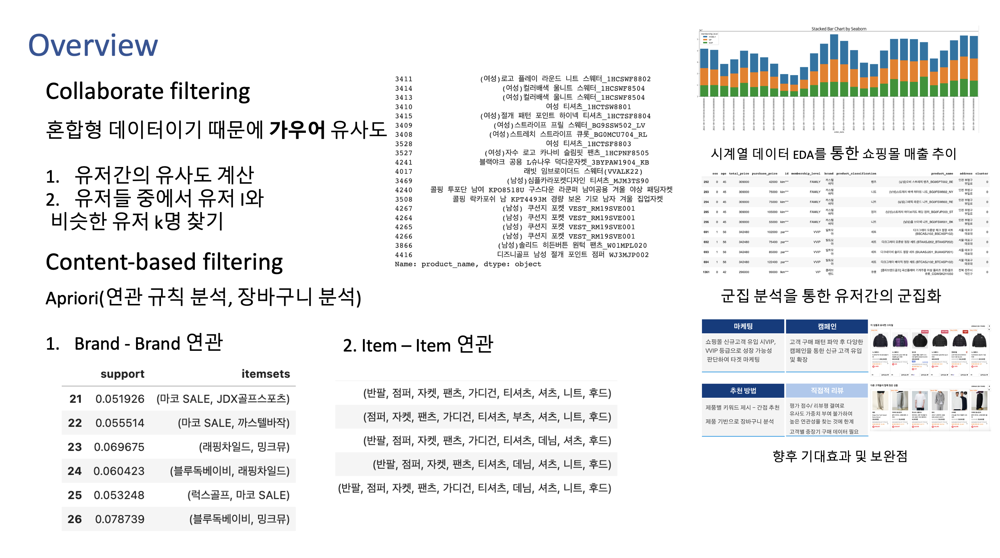

# 2022 Shopping Mall Customer Recommendation System  
Graphical solution that recommend system for customer  
  
> Presentation : [아이스탁몰_쇼핑몰_추천시스템_발표_자료.pdf](./figures/아이스탁몰_쇼핑몰_추천시스템_발표_자료.pdf)   
  
## Solution Overview
  

## About Projects  
1. Recieve de-identification consumer data from Istock Mall Company
2. EDA in time series and figure out sales figures
3. Collaborate recommendation based on Gower similarity because data figures mixed type(number, objective)
4. Content-based recommendation in Brand-Brand, Item-Item
5. Clustering Users
6. Made a presentaion in Istock Mall Company
